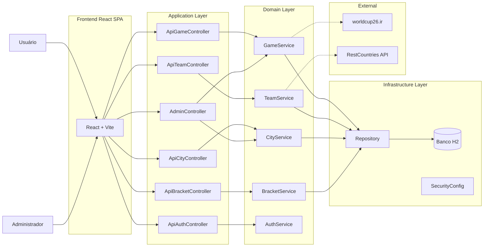
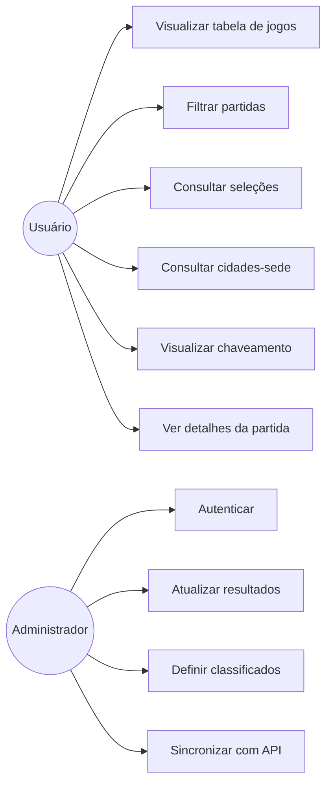
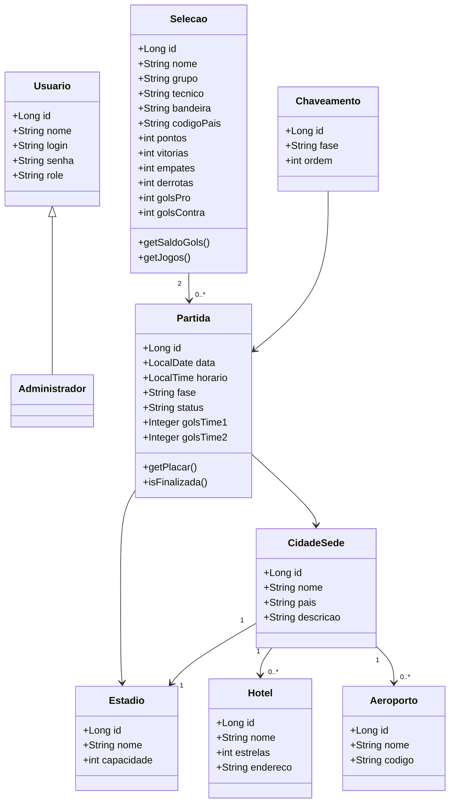
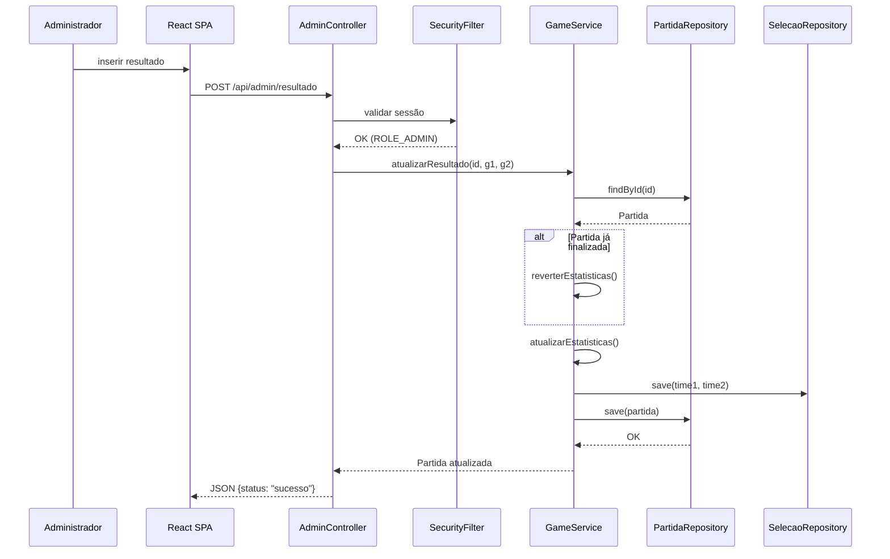
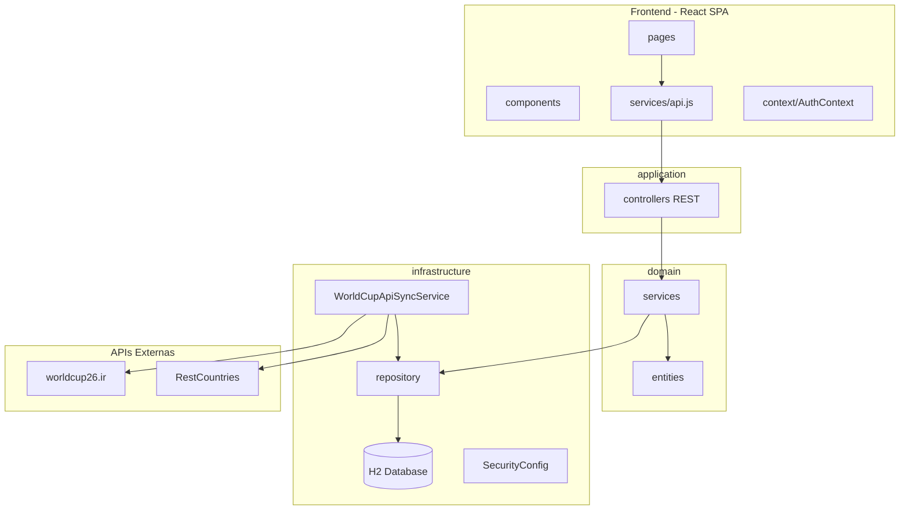

# Projeto Arquitetural e Modelagem UML --- Sistema de Evento Esportivo

Este documento apresenta o **projeto arquitetural** e a **modelagem
UML** do sistema de acompanhamento de eventos esportivos.\
Cada diagrama foi criado a partir dos requisitos funcionais e não
funcionais definidos na especificação do projeto.

------------------------------------------------------------------------

## 🚀 Como Rodar o Projeto

### Pré-requisitos

| Ferramenta | Versão mínima | Obrigatório? | Observação |
|---|---|---|---|
| **JDK (Java)** | 21 | ✅ Sim | |
| **Node.js** | 18+ | ✅ Sim | Para o frontend React |
| **Git** | Qualquer | ✅ Sim | Para clonar o repositório |
| **Maven** | 3.9+ | ❌ Não | Já incluído no projeto via Maven Wrapper (`mvnw`) |

### Instalando o JDK 21

**Windows:**
1. Baixe o JDK 21.
2. Execute o instalador e **marque a opção "Set JAVA_HOME variable"**.

**Linux (Ubuntu/Debian):**
```bash
sudo apt update && sudo apt install openjdk-21-jdk
```

**Mac:**
```bash
brew install openjdk@21
```

**Verificar instalação:**
```bash
java -version
```
> Deve exibir algo como `openjdk version "21.x.x"`.

### Clonando e Executando

```bash
# 1. Clonar o repositório
git clone https://github.com/cordeirolucass/TP-Eng-Soft.git
cd TP-Eng-Soft

# 2. Rodar os testes
./mvnw test              # Linux/Mac
.\mvnw.cmd test           # Windows

# 3. Iniciar o backend (porta 8080)
./mvnw spring-boot:run              # Linux/Mac
.\mvnw.cmd spring-boot:run           # Windows

# 4. Iniciar o frontend em modo desenvolvimento (porta 5173)
cd frontend
npm install
npm run dev
```

### Acesso

| URL | Descrição |
|---|---|
| http://localhost:5173 | Frontend React (desenvolvimento) |
| http://localhost:8080 | Backend Spring Boot (API REST) |
| http://localhost:8080/h2-console | Console do banco H2 |

### Credenciais de Administrador

| Campo | Valor |
|---|---|
| Usuário | `admin` |
| Senha | `admin123` |

Acesse a área administrativa em: **http://localhost:5173/login**

### Build de Produção

```bash
# Gerar o build do React (saída em src/main/resources/static/)
cd frontend
npm run build

# Rodar tudo pelo Spring Boot (serve o React + API)
cd ..
./mvnw spring-boot:run
```

Após o build, acesse tudo em **http://localhost:8080**.

### Observações

- O **banco de dados H2** roda em memória e é populado automaticamente a cada inicialização. Não é necessário instalar nenhum banco.
- As **partidas são sincronizadas** automaticamente com a API da Copa do Mundo 2026 nos primeiros segundos após o início. Aguarde alguns segundos e recarregue a página.
- As **bandeiras dos países** são carregadas automaticamente da API RestCountries durante a sincronização.
- O Maven **não precisa ser instalado**: o projeto usa o Maven Wrapper (`mvnw`), que baixa o Maven automaticamente na primeira execução.

------------------------------------------------------------------------

## 🛠️ Stack Tecnológico

| Camada | Tecnologia |
|---|---|
| Back-end | Java 21 + Spring Boot 3.5 |
| Front-end | React 19 + Vite + React Router |
| Banco de dados | H2 (em memória, ddl-auto=create) |
| Segurança | Spring Security 6 + BCrypt + Session |
| Testes | JUnit 5 + Mockito + MockMvc + @DataJpaTest |
| Build | Maven (via Maven Wrapper) + npm |
| APIs Externas | worldcup26.ir (partidas) + RestCountries (bandeiras) |
| Cobertura | JaCoCo |

------------------------------------------------------------------------

## 🏗️ Projeto Arquitetural --- Diagrama de Componentes

### 📌 Decisão de Arquitetura

Foi adotada uma **Arquitetura em Camadas (Layered Architecture)**
porque:

- Facilita manutenção e evolução do sistema (RNF07).
- Permite separação clara entre interface, regras de negócio e persistência.
- Reduz acoplamento entre módulos.
- Suporta integração com APIs externas.

### 📌 Responsabilidades das Camadas

- **Frontend (React SPA)** → Interface acessada por usuários e administradores.
- **Application Layer** → Controllers REST que orquestram casos de uso.
- **Domain Layer** → Contém regras de negócio do evento esportivo.
- **Infrastructure Layer** → Persistência, segurança e comunicação externa.
- **External** → APIs externas (worldcup26.ir, RestCountries).



------------------------------------------------------------------------

## 🎯 Diagrama de Casos de Uso

### 📌 Decisão de Modelagem

O diagrama identifica **quem interage com o sistema** e **quais
funcionalidades são oferecidas**.

Foram definidos dois atores:

- **Usuário** → Consulta informações do evento.
- **Administrador** → Gerencia resultados e classificação.

A separação reforça o requisito de **segurança e autenticação**.



### 📝 Descrição dos Cenários de Casos de Uso

#### **Atores do Usuário (Consulta)**

* **UC01: Visualizar tabela de jogos (RF01)**:
    * **Ator**: Usuário.
    * **Fluxo Principal**: O sistema exibe a tabela completa com data, horário e local de cada partida.
    * **Pós-condição**: O usuário visualiza o cronograma oficial do evento.

* **UC02: Filtrar partidas (RF05)**:
    * **Ator**: Usuário.
    * **Fluxo Principal**: O usuário seleciona critérios de busca por data, seleção específica ou cidade-sede.
    * **Pós-condição**: O sistema apresenta apenas os jogos que correspondem aos filtros aplicados.

* **UC03: Consultar seleções (RF03)**:
    * **Ator**: Usuário.
    * **Fluxo Principal**: O sistema gera uma lista de todas as seleções participantes e suas informações básicas.
    * **Pós-condição**: O usuário acessa os dados das equipes que disputam o torneio.

* **UC04: Consultar cidades-sede (RF02)**:
    * **Ator**: Usuário.
    * **Fluxo Principal**: O sistema exibe um guia da sede selecionada, incluindo estádio, aeroportos próximos e rede hoteleira.
    * **Pós-condição**: O usuário obtém as informações logísticas necessárias para o deslocamento nas sedes.

* **UC05: Visualizar chaveamento (RF04)**:
    * **Ator**: Usuário.
    * **Fluxo Principal**: O sistema apresenta graficamente a estrutura das fases eliminatórias e os cruzamentos futuros.
    * **Pós-condição**: O usuário compreende o caminho das equipes até a final.

* **UC06: Ver detalhes da partida (RF08)**:
    * **Ator**: Usuário.
    * **Fluxo Principal**: Ao clicar em um jogo específico, o sistema detalha estatísticas e informações extras da partida.
    * **Pós-condição**: O usuário acessa a ficha técnica completa do confronto.

#### **Atores do Administrador (Gestão)**

* **UC07: Autenticar (RNF03)**:
    * **Ator**: Administrador.
    * **Fluxo Principal**: O administrador insere login e senha na área restrita.
    * **Pós-condição**: O acesso às funções de edição é liberado mediante validação de segurança.

* **UC08: Atualizar resultados (RF06)**:
    * **Ator**: Administrador.
    * **Pré-condição**: O administrador deve estar devidamente autenticado.
    * **Fluxo Principal**: O administrador insere os placares das partidas encerradas no sistema.
    * **Pós-condição**: Os dados são salvos e atualizados em tempo real na tabela pública.

* **UC09: Definir classificados (RF06)**:
    * **Ator**: Administrador.
    * **Fluxo Principal**: O administrador confirma quais seleções avançam para as próximas fases com base nos resultados.
    * **Pós-condição**: O gráfico de chaveamento é reordenado com as seleções vitoriosas.

* **UC10: Sincronizar com API (RF09)**:
    * **Ator**: Administrador / Sistema (automático).
    * **Fluxo Principal**: O sistema busca dados atualizados da API worldcup26.ir e enriquece com bandeiras da RestCountries.
    * **Pós-condição**: Partidas e seleções são criadas/atualizadas no banco local.

------------------------------------------------------------------------

## 🧠 Diagrama de Classes

### 📌 Decisão de Modelagem

O modelo de domínio foi construído a partir das **entidades centrais do
evento esportivo**:

- Seleções participantes
- Partidas
- Cidades-sede
- Estrutura logística
- Chaveamento eliminatório

Principais decisões:

- **Administrador herda de Usuário** → reutilização de atributos (Single Table Inheritance).
- **Partida relaciona duas seleções**.
- **CidadeSede agrega infraestrutura** (estádio, hotel, aeroporto).
- **Chaveamento organiza fases eliminatórias**.



------------------------------------------------------------------------

## 🔄 Diagrama de Sequência --- Atualizar Resultado

### 📌 Decisão de Modelagem

Este diagrama representa o fluxo crítico administrativo:

1. Administrador envia resultado.
2. Sistema valida autenticação via sessão.
3. Regra de negócio atualiza dados (com reversão de stats anteriores se necessário).
4. Persistência salva alteração.

Motivos:

- Evidenciar requisito de **segurança**.
- Mostrar separação Controller → Service → Repository.
- Demonstrar fluxo real de backend REST.



------------------------------------------------------------------------

## 📦 Diagrama de Pacotes

### 📌 Decisão de Modelagem

O diagrama organiza o código em módulos independentes:

- **frontend** → SPA React (componentes, páginas, serviços).
- **application** → controladores REST.
- **domain** → entidades e regras de negócio.
- **infrastructure** → banco, segurança e integrações externas.

Benefícios:

- Alta coesão.
- Baixo acoplamento.
- Facilita testes e manutenção.



------------------------------------------------------------------------

## ✅ Conclusão Arquitetural

A combinação dos diagramas garante:

- Alinhamento entre requisitos e implementação.
- Separação clara de responsabilidades.
- Frontend desacoplado do backend (SPA + REST API).
- Base sólida para evolução futura do sistema.

------------------------------------------------------------------------

## 📊 Cobertura de Testes (JaCoCo)

O projeto utiliza o **JaCoCo** para medir a cobertura de código dos testes automatizados.

### Como gerar o relatório

```bash
# Roda os testes e gera o relatório de cobertura
./mvnw verify              # Linux/Mac
.\mvnw.cmd verify           # Windows
```

### Como visualizar

Após executar, abra o arquivo no navegador:

```
target/site/jacoco/index.html
```

O relatório mostra cobertura por **pacote**, **classe**, **método** e **linha**, com código colorido:
- 🟢 Verde = linha coberta pelos testes
- 🔴 Vermelho = linha não coberta
- 🟡 Amarelo = parcialmente coberta (branch)
